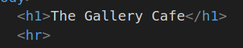
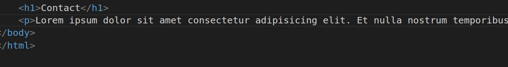

# The Gallery Cafe
 My project Explanation
 
1.

##### Explanation 
* h1 Tag is used for Headings in document

2.
##### Explanation
* hr tag is used for insert a horizantal rule or thematic break in an HTML page

3.
##### Explanation
* here h4 tag is used for small heading 
* p tag is paragraph tag 
* strong is inline element and is used to highlight important text in a paragraph.
* a is anchor tag and href is used to determine link destination.

4.
##### Explanation
* Here h1 tag is used for heading which describes Menu
* h4 tag is used for small heading
* ol is an ordered list 
* here it will lists all the items in menu in order using ol list

5.
##### Explanation
* h4 tag is used for heading which describes state
* ol list lists all items in menu of that state

6.
##### Explanation
* h4 is used for heading which describes state
* ol list lists all items in menu of that state

7.
##### Explanation
* h1 tag is sused for heading
* p is uesd for paragraph which describes the contact details of Gallery Cafe.

